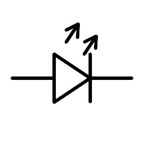
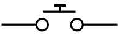

# 🔌 Electronics Basics 101 (15 minutes)

Three core concepts. That's it. Master these and you're good to go.

## Concept #1: Voltage (V) - The "Push"

Think of electricity like water flowing through a pipe:
- **Voltage = Water Pressure** (how hard it's pushing)
- Our projects use **3.3V or 5V** (low, safe voltages)

**Why it matters:** Too much voltage = fried components. Too little = nothing works.

## Concept #2: Current (I) - The "Flow"

- **Current = Water Flow** (how much water moves)
- Measured in **Amps (A)** or **Milliamps (mA)**
- Typical LED: ~20mA

**Why it matters:** Too much current = burned-out LED. We use resistors to limit it.

## Concept #3: Resistance (R) - The "Brake"

- **Resistance = Narrow Pipe** (slows down flow)
- Measured in **Ohms (Ω)**
- 220Ω resistor = perfect for LEDs

**The magic formula:**
```
Voltage = Current × Resistance
V = I × R  (Ohm's Law)
```

## 🎬 Video: What is a Microcontroller? (4 min)

**Watch this first:** [What is a Microcontroller?](https://www.youtube.com/watch?v=7BLKCZhlwBA) by Core Electronics

**What you'll learn:**
- What a microcontroller actually is
- Why it's different from a regular computer
- Real-world examples of microcontrollers

⏱️ **4 minutes. Go watch it now!**

## LEDs (Light-Emitting Diodes)

### Two Key Rules

**Rule #1: Polarity Matters**

LED Symbol: 




Real LED:
```
  ┌──────   Long leg (+) = Positive (anode)
╭─│
╰─│
  └────     Short leg (-) = Negative (cathode)
─────          
Flat side = negative (-), this edge connects to GND
```

**Rule #2: Always Use a Resistor**

WRONG ❌
```
3.3V ─── LED ─── GND
(LED burns out, releases magic smoke)
```

RIGHT ✅
```
3.3V ─── [Resistor 220Ω] ─── LED ─── GND
(LED glows happily for years)
```

### Why the Resistor?

Resistor limits current to a safe level (~20mA for LEDs). Without it, too much current flows → LED overheats → burns out.

## Buttons - The Simple Switch



- **Pressed:** Completes the circuit (electricity flows)
- **Released:** Breaks the circuit (electricity stops)
- **No polarity:** Works either way

---

## Breadboards - Build Without Soldering

### How They Work

- **Holes** are electrically connected in **rows**
- Push components in → they're connected
- No soldering needed!
- Easy to rearrange and experiment

### Connection Pattern

```
Typical 400-pin breadboard layout:

    + -    A B C D E   |   F G H I J   + -
  1 ⭕⭕  ⭕⭕⭕⭕⭕  |  ⭕⭕⭕⭕⭕ ⭕⭕
  2 ⭕⭕  ⭕⭕⭕⭕⭕  |  ⭕⭕⭕⭕⭕ ⭕⭕
  3 ⭕⭕  ⭕⭕⭕⭕⭕  |  ⭕⭕⭕⭕⭕ ⭕⭕
  4 ⭕⭕  ⭕⭕⭕⭕⭕  |  ⭕⭕⭕⭕⭕ ⭕⭕
  5 ⭕⭕  ⭕⭕⭕⭕⭕  |  ⭕⭕⭕⭕⭕ ⭕⭕
  6 ⭕⭕  ⭕⭕⭕⭕⭕  |  ⭕⭕⭕⭕⭕ ⭕⭕
  ...

LEFT SIDE (A-E) = NOT connected to RIGHT SIDE (F-J)
TOP = NOT connected to BOTTOM
POWER/GROUND rails = connected vertically
```

### Key Rule
If two wires go in the same **row** (left or right side), they're **electrically connected**.

## ESP32 Pins

Your ESP32 has many pins. For these workshops, we mainly use:

| Pin | Purpose |
|-----|---------|
| GPIO 2 | LED output|
| GPIO 4 | Button input|
| GPIO 5 | Sensor input|
| 3.3V | Power (+)|
| GND | Ground (-)|

**GPIO = General-Purpose Input/Output**

## ✅ You're Ready!

You now understand:
- ✅ Voltage, current, and resistance
- ✅ LED polarity and resistor purpose
- ✅ How buttons and breadboards work
- ✅ What microcontroller pins do

**Next →** [Arduino IDE Setup](./02-arduino-setup.md)

