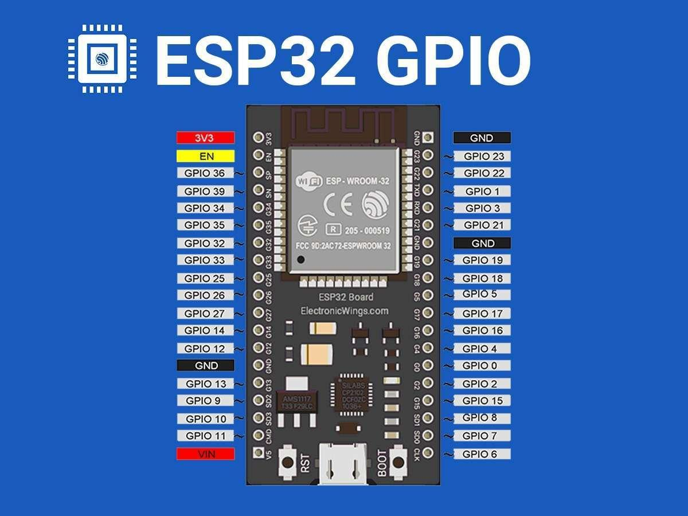

# 🔌 Workshop 1: Circuit Diagram & Build Guide

## Complete Circuit Overview

You'll build TWO circuits in Workshop 1:
1. **Circuit 1:** LED only (for blink test)
2. **Circuit 2:** LED + Button (full project)

---

## 📟 ESP32 Pinout Reference

Keep this handy while you wire things up. Every pin labelled `GPIO` (General Purpose
Input/Output) can be controlled from code. We only use **GPIO 2**, **GPIO 4**, a
**GND** pin, and the **3.3V** pin today, but it helps to see where they sit on the board.

{ width="700" loading=lazy }

!!! tip "Which pins should I use?"
    Not every GPIO is equal. Some are input-only, some are used internally during
    boot. GPIO 2 and GPIO 4 are safe, beginner-friendly choices and that's why this
    workshop uses them. When you design your own circuits later, check the pinout
    before picking a pin.

---

## 🧠 Meet the Arduino IDE

Before we build, a quick tour of the tool you'll write code in. The **Arduino IDE**
is where you type your program, check it for mistakes, and send it to the ESP32.
Keep this light - you'll learn most of it by doing.

### `setup()` and `loop()` - the two functions every sketch has

An Arduino program (called a **sketch**) always has these two functions:

- **`setup()`** runs **once**, the moment the board powers on or resets. You use it
  to get things ready: set pin modes, start the serial connection, print a welcome
  message.
- **`loop()`** runs **over and over, forever**, immediately after `setup()` finishes.
  The instant it reaches the bottom, it starts again from the top. This is where
  the actual behaviour lives - read a button, blink an LED, and so on.

```cpp
void setup() {
  // runs ONCE at startup
}

void loop() {
  // runs FOREVER, top to bottom, again and again
}
```

If `setup()` is "getting dressed in the morning", `loop()` is "the rest of your day,
on repeat".

### Adding your own functions

You're not limited to `setup()` and `loop()`. When a chunk of code gets repetitive
or hard to read, give it a name and pull it out into its own function:

```cpp
void blinkOnce() {
  digitalWrite(2, HIGH);
  delay(200);
  digitalWrite(2, LOW);
  delay(200);
}

void loop() {
  blinkOnce();   // call it as many times as you like
  blinkOnce();
}
```

Define the function once, call it whenever you need it. This keeps `loop()` short
and readable.

### Defining constants

A **constant** is a name for a value that never changes while the program runs.
Instead of scattering the number `2` all over your code, name it once:

```cpp
const int LED_PIN = 2;   // now "LED_PIN" means pin 2 everywhere
```

Two reasons this matters: the code reads like plain English (`digitalWrite(LED_PIN, HIGH)`),
and if you move the LED to a different pin you change **one line** instead of hunting
for every `2`. The `const` keyword tells the compiler "this will not change" - if you
accidentally try to change it, you get an error instead of a silent bug.

### Verifying and uploading

Two buttons at the top-left of the IDE do the work:

- **Verify** (the checkmark ✓) - **compiles** your code. It translates your text into
  instructions the ESP32 understands and checks for mistakes. Nothing is sent to the
  board yet. Verify early and often; it's the fastest way to catch typos.
- **Upload** (the arrow ➡) - compiles **and then sends** the program to the ESP32 over
  the USB cable. Once it finishes, your code is running on the board.

A useful habit: **Verify** to catch errors, **Upload** when it's clean.

### Digital vs. analog - input and output

The ESP32 talks to the world in two styles. This distinction comes up constantly:

| | **Digital** | **Analog** |
|---|---|---|
| **Values** | Only two: `HIGH` or `LOW` (on / off, 3.3V / 0V) | A whole range, not just two |
| **Output** | `digitalWrite(pin, HIGH)` - fully on or fully off. Good for: LED on/off, relay. | `ledcWrite(...)` (PWM) - fakes "in between" levels. Good for: LED brightness, motor speed. |
| **Input** | `digitalRead(pin)` - returns `HIGH` or `LOW`. Good for: is the button pressed? | `analogRead(pin)` - returns a number across a range. Good for: light sensor, potentiometer. |

Rule of thumb: **digital** is a light switch (on or off). **Analog** is a dimmer knob
(anywhere in between). Today's LED and button are both **digital**. In later workshops
the light sensor will be **analog**.

!!! note "Pre-workshop recap"
    If you did the pre-workshop, this overlaps with
    [Your First Sketch](../0-pre-workshop/03-first-sketch.md) - that's intentional.
    A quick second pass right before you build is worth it.

---

## Circuit 1: LED Blink (Warm-up)

### Schematic Diagram

```
ESP32 Pin GPIO2 ─── [220Ω Resistor] ─── LED(+) ─┐
                                                  │
ESP32 Pin GND ────────────────────────────────────┘
```

### Physical Build Instructions

1. **Insert LED into breadboard**
   - Long leg (positive/anode) in row 10, column E
   - Short leg (negative/cathode) in row 11, column E

2. **Connect resistor**
   - One end in row 10, column D (same row as LED+ leg)
   - Other end in row 7, column D

3. **Wire from ESP32 to resistor**
   - Jumper wire: ESP32 GPIO2 pin → breadboard row 7, column C

4. **Wire from LED to ground**
   - Jumper wire: Breadboard row 11, column C → ESP32 GND pin

**Visual:**
```
ESP32                    Breadboard
┌────┐                   Row 7:  [Resistor end]
│    │                   Row 10: [LED Long leg +]
│GPIO2├──────(red wire)────────→ Row 7
│    │                   
│ GND├──────(black wire)───────→ Row 11
│    │                   Row 11: [LED Short leg -]
└────┘                   
```

??? example "💻 Code: LED Blink (Warm-up) — click to expand"
    Full file: [`code-led-blink.ino`](code-led-blink.ino)

    ```cpp
    // =====================================
    // Workshop 1: Simple LED Blink
    // Your very first Arduino sketch!
    // =====================================
    //
    // Hardware: 1x LED + 1x 220 ohm resistor
    // Pin: GPIO 2 -> 220 ohm resistor -> LED -> GND
    // Libraries: None (built-in only)

    void setup() {
      // setup() runs ONCE when board powers on
      Serial.begin(9600);
      pinMode(2, OUTPUT);  // Set pin 2 to output mode
      Serial.println("LED Blink starting...");
    }

    void loop() {
      // loop() runs forever, over and over
      digitalWrite(2, HIGH);  // Turn LED on (3.3V)
      Serial.println("LED ON");
      delay(1000);            // Wait 1 second (1000 milliseconds)

      digitalWrite(2, LOW);   // Turn LED off (0V)
      Serial.println("LED OFF");
      delay(1000);            // Wait 1 second
    }
    ```

---

## Circuit 2: LED + Button (Main Project)

### Schematic Diagram

We use the ESP32's **internal pull-down resistor** on the button input, so no external 10kΩ is needed. The button just connects GPIO 4 to 3.3V when pressed.

```
ESP32 GPIO 2  ─── [220Ω] ─── LED(+) ─── LED(-) ─── GND
ESP32 GPIO 4  ─── [Button] ─── 3.3V
                  (internal pull-down keeps GPIO 4 LOW when not pressed)
```

### Physical Build Instructions

**Starting from Circuit 1 (LED already built), now add the button:**

5. **Insert button into breadboard**
   - Place button across the center divide (pins in rows 15 & 17)
   - Buttons have 4 legs - two pairs are internally connected

6. **Connect button to ESP32 GPIO 4**
   - Jumper wire: ESP32 GPIO 4 pin → breadboard row 15, column F (button leg)

7. **Connect button's other side to 3.3V** (not GND)
   - Jumper wire: Breadboard row 17, column J → ESP32 **3.3V** pin
   - (Sharing the 3.3V rail across the breadboard is fine)

### Pin Connection Summary Table

| Component | Component Side | ESP32 Pin | Wire Color (Suggested) |
|-----------|----------------|-----------|------------------------|
| LED Long Leg (+) | Via 220Ω resistor | GPIO 2 | Red |
| LED Short Leg (-) | Direct | GND | Black |
| Button Side 1 | Direct | GPIO 4 | Yellow/Green |
| Button Side 2 | Direct | **3.3V** | Red |
| Resistor (LED) | Between GPIO 2 and LED+ | - | - |

### Complete Physical Layout

```
     USB Port
        ↑
  ┌─────┴──────────┐
  │     ESP32      │
  │                │
  │ GPIO2  GPIO4   │  
  │   ↓      ↓     │
  └───┼──────┼─────┘
      │      │
      │      │ (yellow wire)
      │      ↓
      │   Row 15: [Button Leg 1]
      │      |
      │      | (button body)
      │      |
      │   Row 17: [Button Leg 2]
      │      ↓
      │   (black wire to GND)
      │
      ↓ (red wire)
   Row 7: [Resistor end]
      |
   Row 10: [LED Long +]
      |
   Row 11: [LED Short -]
      ↓
   (black wire to GND)
```

### Behaviour

This is the **momentary** build: the LED is on **only while the button is held
down**, and turns off the instant you let go. Press = light, release = dark.

(Want a press to *latch* the LED on until the next press? That's the
[bonus build](#circuit-3-led-toggle-bonus-build) below.)

??? example "💻 Code: LED + Button (Main Project) — click to expand"
    Full file: [`code-led-button.ino`](code-led-button.ino)

    ```cpp
    // =====================================
    // WORKSHOP 1: LED CONTROLLED BY BUTTON
    // Your first real interactive circuit!
    // =====================================
    //
    // Hardware: 1x LED + 1x 220 ohm resistor + 1x push button
    // Pins: GPIO 2 -> LED, GPIO 4 -> Button
    // Libraries: None (built-in only)

    // ===== PIN DEFINITIONS =====
    const int LED_PIN = 2;      // LED connected to GPIO pin 2
    const int BUTTON_PIN = 4;   // Button connected to GPIO pin 4

    // ===== SETUP (runs once at startup) =====
    void setup() {
      // Start serial communication for debugging
      Serial.begin(9600);

      // Configure pins
      pinMode(LED_PIN, OUTPUT);            // LED is something we control (output)
      pinMode(BUTTON_PIN, INPUT_PULLDOWN); // Button is an input with internal pull-down

      // Print welcome message
      Serial.println("=== LED + Button Circuit ===");
      Serial.println("Press the button to control the LED!");
      Serial.println("");
    }

    // ===== MAIN PROGRAM (runs forever) =====
    void loop() {
      // Read the button state
      // HIGH = pressed (button makes connection)
      // LOW = released (button breaks connection)
      int buttonState = digitalRead(BUTTON_PIN);

      // If button is pressed
      if (buttonState == HIGH) {
        digitalWrite(LED_PIN, HIGH);  // Turn LED on
        Serial.println("Button pressed - LED ON");

      } else {
        // Button is not pressed
        digitalWrite(LED_PIN, LOW);   // Turn LED off
        Serial.println("Button released - LED OFF");
      }

      // Wait a bit before checking again
      // (prevents Serial from printing too fast)
      delay(100);
    }
    ```

    The full file also includes the **stretch goals** (toggle, non-blocking blink,
    PWM brightness, debounce counter) as commented challenges.

---

## Circuit 3: LED Toggle (Bonus Build)

**Same wiring as Circuit 2 - nothing to rebuild.** Only the code changes.

### Behaviour

This is the **latching** build: press the button once and the LED turns **on and
stays on**. Press it again and it turns **off**. The LED holds its state between
presses - you don't have to keep your finger down.

| Build | Press the button | Release the button |
|-------|------------------|---------------------|
| Circuit 2 (main) | LED on | LED off |
| Circuit 3 (bonus) | LED flips on/off | LED stays as it was |

### How it works - edge detection

The main project reacts to the button **being** HIGH. This bonus build reacts to
the button **becoming** HIGH - the exact moment of the press, called the
**rising edge**.

To spot that moment, the code remembers what the button read last time
(`lastButtonState`). When the previous reading was `LOW` and the current reading is
`HIGH`, a fresh press just happened, so we flip the LED. Holding the button does
nothing extra because there's no new edge until you release and press again.

??? example "💻 Code: LED Toggle (Bonus Build) — click to expand"
    Full file: [`code-led-button-toggle.ino`](code-led-button-toggle.ino)

    ```cpp
    // ==========================================
    // WORKSHOP 1 (BONUS): LED TOGGLED BY BUTTON
    // Press once = LED on. Press again = LED off.
    // ==========================================
    //
    // Hardware: 1x LED + 1x 220 ohm resistor + 1x push button
    // Pins: GPIO 2 -> LED, GPIO 4 -> Button
    // Same circuit as code-led-button.ino - only the code changes.

    // ===== PIN DEFINITIONS =====
    const int LED_PIN = 2;      // LED connected to GPIO pin 2
    const int BUTTON_PIN = 4;   // Button connected to GPIO pin 4

    // ===== STATE VARIABLES =====
    // These keep their value between loop() runs.
    bool ledOn = false;             // Is the LED currently on? Starts off.
    int lastButtonState = LOW;      // What the button read on the previous loop.

    // ===== SETUP (runs once at startup) =====
    void setup() {
      Serial.begin(9600);

      pinMode(LED_PIN, OUTPUT);            // LED is an output
      pinMode(BUTTON_PIN, INPUT_PULLDOWN); // Button is an input with internal pull-down

      digitalWrite(LED_PIN, LOW);          // Make sure the LED starts off

      Serial.println("=== LED Toggle (bonus build) ===");
      Serial.println("Press the button to toggle the LED on and off.");
      Serial.println("");
    }

    // ===== MAIN PROGRAM (runs forever) =====
    void loop() {
      // Read the button right now.
      int buttonState = digitalRead(BUTTON_PIN);

      // Rising edge: it was LOW last time, and it is HIGH now.
      // That means the button was just pressed THIS loop.
      if (buttonState == HIGH && lastButtonState == LOW) {
        ledOn = !ledOn;                       // Flip the LED state
        digitalWrite(LED_PIN, ledOn ? HIGH : LOW);
        Serial.println(ledOn ? "Press detected - LED ON" : "Press detected - LED OFF");

        delay(50);   // Small wait so one press isn't read as several (debounce)
      }

      // Remember this reading so the next loop can compare against it.
      lastButtonState = buttonState;
    }
    ```

---

## 🔻 Why Buttons Need a Pull-up (or Pull-down) Resistor

This trips up almost everyone, so it's worth understanding properly.

### The problem: a "floating" pin

A digital input pin always reports `HIGH` or `LOW` - but it has to be physically
connected to 3.3V or GND for that reading to mean anything.

Think about a simple button wired to just **one** thing - say, GPIO 4 to 3.3V:

- **Button pressed:** GPIO 4 is connected to 3.3V → reads `HIGH`. ✅ Clear.
- **Button released:** GPIO 4 is connected to... **nothing**. The pin is
  *floating*. ❌

A floating pin isn't a clean `LOW`. With no fixed connection it acts like a tiny
antenna, picking up electrical noise from the air, your hand, nearby wires. Its
reading flickers randomly between `HIGH` and `LOW`. Your LED would flash on and off
on its own and you'd swear the button was haunted.

### The fix: a pull resistor

A **pull resistor** gives the pin a *default* value for when the button isn't
pressed. It's a high-value resistor (around 10kΩ) connecting the pin to a known
voltage:

- **Pull-down resistor** - connects the pin to **GND**. Default reading: `LOW`.
  Pressing the button connects the pin to 3.3V, which overpowers the weak pull-down,
  so it reads `HIGH`.
- **Pull-up resistor** - connects the pin to **3.3V**. Default reading: `HIGH`.
  Pressing the button connects the pin to GND, so it reads `LOW`.

Either way, the pin is *never* floating. Released = the default; pressed = the
opposite. No more random flicker.

```
PULL-DOWN (what this workshop uses)        PULL-UP (the classic alternative)

  3.3V                                       3.3V
   │                                          │
 [Button]                                  [10kΩ resistor]
   │                                          │
   ├──────── GPIO 4                            ├──────── GPIO 4
   │                                          │
 [10kΩ resistor]                            [Button]
   │                                          │
  GND                                        GND

 Released: pin pulled to GND  -> LOW        Released: pin pulled to 3.3V -> HIGH
 Pressed:  pin pulled to 3.3V -> HIGH       Pressed:  pin pulled to GND  -> LOW
```

!!! question "Why a *resistor* and not just a wire to GND?"
    A plain wire from the pin to GND would force it `LOW` permanently - pressing the
    button would then create a direct 3.3V-to-GND short circuit. The resistor's job
    is to be a *weak* connection: strong enough to set a default when nothing else
    is happening, weak enough that the button easily overrides it without shorting
    anything. It "pulls" gently, hence the name.

### The shortcut: the ESP32 has these built in

You rarely need to add a physical pull resistor, because the ESP32 has them inside
the chip. You switch them on in code with `pinMode()`:

- `pinMode(BUTTON_PIN, INPUT_PULLDOWN);` - enables the **internal pull-down**.
  Released reads `LOW`, pressed reads `HIGH`. **This is what our sketches use**, and
  it's why the button wires to **3.3V**, not GND.
- `pinMode(BUTTON_PIN, INPUT_PULLUP);` - enables the **internal pull-up**.
  Released reads `HIGH`, pressed reads `LOW`. If you use this, wire the button to
  **GND** and flip your `if`/`else` logic.
- `pinMode(BUTTON_PIN, INPUT);` - **plain input, no pull resistor**. The pin floats.
  Avoid this for a bare button unless you've added your own external resistor.

!!! warning "If the LED behaves backwards or randomly"
    A button that seems inverted or jittery is almost always a pull-resistor
    mismatch: `INPUT_PULLDOWN` in code but the button wired to GND, or `INPUT` with
    no pull at all. Match the mode to the wiring - pull-down ↔ 3.3V, pull-up ↔ GND -
    and the ghost goes away.

---

## How the Circuit Works

### LED Circuit
1. **GPIO2 goes HIGH (3.3V)** → Current flows through resistor → LED lights up → Returns to GND
2. **GPIO2 goes LOW (0V)** → No current flow → LED is off

### Button Circuit
1. **Button NOT pressed:** GPIO 4 reads LOW because the ESP32's internal pull-down resistor weakly ties the pin to GND.
2. **Button IS pressed:** GPIO 4 reads HIGH because the button now connects it directly to 3.3V (which overrides the weak pull-down).

The internal pull-down is enabled by `pinMode(BUTTON_PIN, INPUT_PULLDOWN);` - that's why we don't need an external 10kΩ resistor in this circuit. See [Why Buttons Need a Pull-up](#why-buttons-need-a-pull-up-or-pull-down-resistor) above for the full picture.

---

## Common Mistakes & Fixes

### ❌ LED won't light up
- **Check:** Long leg connected to GPIO2 side (via resistor)?
- **Check:** Short leg connected to GND?
- **Try:** Flip the LED around (reversed polarity)

### ❌ LED stays dimly lit
- **Check:** Resistor is included (LED without resistor can glow dimly when it shouldn't)

### ❌ Button doesn't work
- **Check:** Button is across the breadboard center divide
- **Check:** One button leg goes to GPIO 4, the other to **3.3V** (not GND - the code uses `INPUT_PULLDOWN`)
- **Check:** Code has `pinMode(BUTTON_PIN, INPUT_PULLDOWN);`

### ❌ LED lights up backwards (on when button released)
- This is actually a pull-up/pull-down issue
- **Fix:** Change code from `INPUT_PULLDOWN` to `INPUT_PULLUP` and reverse the if/else logic

---

## Testing Your Circuit

### Test #1: LED Blink (No Button Needed)
Upload [code-led-blink.ino](code-led-blink.ino) → LED should blink on/off every second

### Test #2: LED + Button
Upload [code-led-button.ino](code-led-button.ino) → LED lights up when button pressed

### Test #3: LED Toggle (Bonus)
Upload [code-led-button-toggle.ino](code-led-button-toggle.ino) → each press flips the LED on or off

---

## 🖥️ Try It in a Simulator

Don't have your hardware yet? You can test your code in [Wokwi](https://wokwi.com/), a free online ESP32 simulator:

1. Go to [wokwi.com](https://wokwi.com/)
2. Click **"New Project"** → select **ESP32**
3. Add an LED and resistor from the parts panel
4. Wire them up like the circuit above
5. Paste the blink code and click **Play**

Wokwi lets you test your code before building the physical circuit!

---

**Stuck?** Check [Workshop 1 Troubleshooting](troubleshooting.md)
