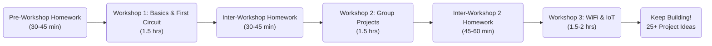

# 🔌 Embedded Electronics 101: ESP32 Workshop Series

Welcome! This is your complete guide to learning embedded electronics with the ESP32 microcontroller. Whether you're a complete beginner or have some experience, these workshops will get you building cool stuff in no time.

> **📱 [View the interactive website version](https://zoharsf.github.io/embedded-electronics-101/)** - Better navigation and mobile-friendly!

## 🎯 What You'll Learn

- **Workshop 1:** Microcontroller basics, breadboards, LEDs, buttons, and your first interactive circuit
- **Workshop 2:** Sensors, data reading, and building a complete project (4 options to choose from)
- **Workshop 3:** WiFi connectivity, Bluetooth, web servers and IoT dashboards
- **Beyond:** Ideas for many future projects to continue learning (in Resources section)

## 🚀 Quick Navigation

| I want to... | Go here |
|---|---|
| **Start from scratch** (new to electronics) | [Pre-Workshop Homework](/0-pre-workshop/) (30-45 min) |
| **Prepare for Workshop 1** | [Pre-Workshop Homework](/0-pre-workshop/) |
| **Review Workshop 1 materials** | [Workshop 1: Basics & First Circuit](/1-workshop-1/) |
| **Get homework between workshops** | [Inter-Workshop Homework](/2-inter-workshop/) |
| **Work on Workshop 2 projects** | [Workshop 2: Group Projects](/3-workshop-2/) |
| **Prepare for Workshop 3** | [Inter-Workshop 2 Homework](/4-inter-workshop/) |
| **Build connected IoT projects** | [Workshop 3: WiFi & Bluetooth](/5-workshop-3/) |
| **Find project ideas** | [Project Inspiration](/resources/inspiration.md) |
| **Fix a problem** | [Troubleshooting Guide](/resources/troubleshooting-master.md) |
| **Learn more** | [Resources & Further Reading](/resources/) |

## 📚 The Complete Learning Path

**Total workshop time:** ~5 hours hands-on + 2 hours homework = **7 hours** to go from zero to building connected IoT projects!

## 🛠️ Your Complete Kit Includes

**Microcontroller & Power:**
- 1x ESP32 Development Board (the brains!)
- 1x USB-C Cable (power + programming)

**Building & Wiring:**
- 1x Breadboard (400 pins)
- Multiple Jumper Wires (male-to-male, various colors)

**Components:**
- 5x LEDs (red, green, blue, yellow, white)
- 1x DHT11 Sensor (temperature & humidity)
- 1x Light-Sensitive Resistor (brightness detector)
- Multiple Push Buttons (user input)
- Multiple 220Ω Resistors (current limiting)

→ Full [Kit Contents & BOM](/KIT_CONTENTS.md)

## 💡 Core Concepts You'll Master

By the end of these workshops, you'll understand:
- ✅ How microcontrollers work and how to program them
- ✅ Digital inputs and outputs (LEDs, buttons)
- ✅ How to read sensor data (temperature, humidity, light)
- ✅ WiFi connectivity and web servers
- ✅ Bluetooth communication
- ✅ Building IoT dashboards and connected devices
- ✅ Writing Arduino code that controls real hardware
- ✅ Debugging circuits and code when things don't work
- ✅ How to design and build your own projects

**Plus:** Access to multiple project ideas to keep learning!

## 🎓 Why These Workshops Rock

- **Hands-on:** Every concept is something you build, not just read about
- **Beginner-friendly:** Zero experience needed - we start from the absolute basics
- **Project-based:** In Workshop 2, you choose what you want to build
- **Take-home value:** Keep your kit and projects after the workshops
- **Self-paced:** All materials stay accessible for future reference
- **Community:** Share your projects and learn from other participants
- **Beyond the workshops:** Multiple project ideas to keep you building

## 🤔 Questions or Issues?

- **Stuck during setup?** → [Troubleshooting Master Guide](/resources/troubleshooting-master.md)
- **Don't know what a term means?** → [Electronics Glossary](/resources/glossary.md)
- **Need component specs?** → [Component Datasheets](/resources/component-datasheets.md)
- **Looking for project ideas?** → [Project Inspiration](/resources/inspiration.md) (Multiple ideas!)
- **Want video tutorials?** → [Video Playlist](/resources/video-playlist.md)
- **Want to learn more?** → [Resources & Further Reading](/resources/README.md)

## 📝 License

MIT License - Use this however you want! Share it, modify it, run your own workshops with it.

---

**Ready to build something awesome?** Start here → [Pre-Workshop Homework](/0-pre-workshop/README.md)

Good luck! 🚀
