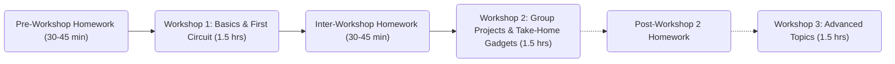

# 🔌 Embedded Electronics 101: ESP32 Workshop Series

Welcome! This is your complete guide to learning embedded electronics with the ESP32 microcontroller. Whether you're a complete beginner or have some experience, these workshops will get you building cool stuff in no time.

## 🎯 What You'll Learn

- **Workshop 1:** Microcontroller basics, breadboards, LEDs, buttons, and your first real code
- **Workshop 2:** Sensors, data reading, and building a take-home gadget
- **Workshop 3 (Optional):** WiFi connectivity, Bluetooth and hosting web pages on ESP32

## 🚀 Quick Navigation

| I want to... | Go here |
|---|---|
| **Start from scratch** (new to this) | [Pre-Workshop Homework](/pre-workshop/) (30-45 min) |
| **Prepare for Workshop 1** | [Pre-Workshop Homework](/pre-workshop/) |
| **Review Workshop 1 materials** | [Workshop 1](/workshop-1/) |
| **Get homework between workshops** | [Inter-Workshop Homework](/inter-workshop/) |
| **Find Project 2 templates** | [Workshop 2](/workshop-2/) |
| **Learn advanced topics** | [Workshop 3](/workshop-3/) |
| **Find answers & resources** | [Resources & Troubleshooting](/resources/) |

## 📚 The Complete Learning Path

## 🛠️ Your Complete Kit Includes

**Microcontroller & Power:**
- 1x ESP32 Development Board (the brains!)
- 1x USB-C Cable (power + programming)

**Building & Wiring:**
- 1x Breadboard (400 pins)
- Multiple Jumper Wires (male-to-male, various colors)

**Components:**
- 5x LEDs (red, green, blue, yellow, white)
- 1x DHT11 Sensor (temperature & humidity)
- 1x Light-Sensitive Resistor (brightness detector)
- Multiple Push Buttons (user input)
- Multiple 220Ω Resistors (current limiting)

→ Full [Kit Contents & BOM](/KIT_CONTENTS.md)

## 💡 Core Concepts You'll Master

By the end of these workshops, you'll understand:
- ✅ How microcontrollers work
- ✅ Digital inputs and outputs
- ✅ How to read sensors
- ✅ Writing Arduino code that actually does stuff
- ✅ Debugging when things don't work
- ✅ How to extend projects with your own ideas

## 🎓 Why These Workshops Rock

- **Hands-on:** Every concept is something you build, not just read
- **Beginner-friendly:** Zero experience needed
- **Project-based:** You choose what you want to build in Workshop 2
- **Take-home value:** Keep your gadget after Workshop 2!
- **Self-paced:** All materials are accessible for future reference
- **Community:** Share your projects with other participants

## 🤔 Questions or Issues?

- **Stuck during setup?** → [Troubleshooting Master Guide](/resources/troubleshooting-master.md)
- **Don't know what a term means?** → [Glossary](/resources/glossary.md)
- **Want to learn more?** → [Resources & Further Reading](/resources/README.md)

## 📝 License

MIT License - Use this however you want! Share it, modify it, run your own workshops with it.

---

**Ready to build something awesome?** Start here → [Pre-Workshop Homework](/pre-workshop/README.md)

Good luck! 🚀
